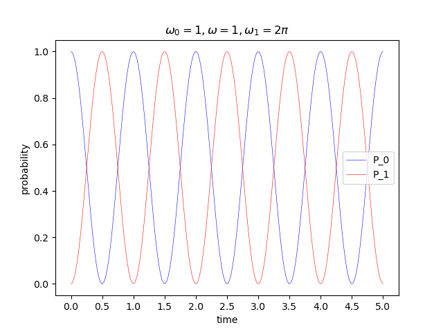
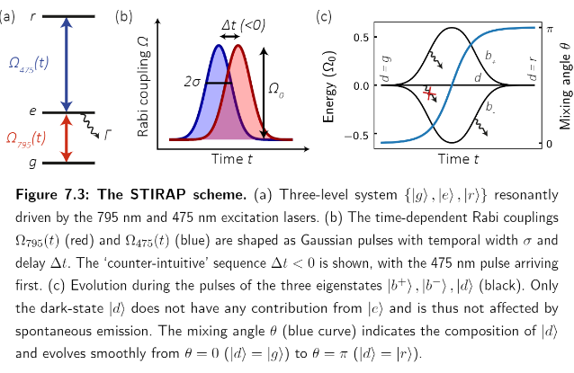
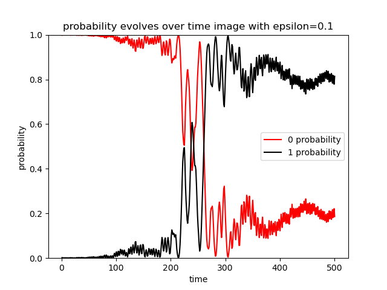
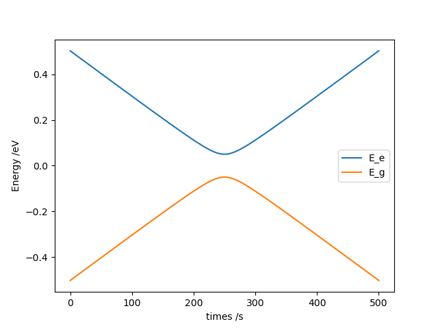
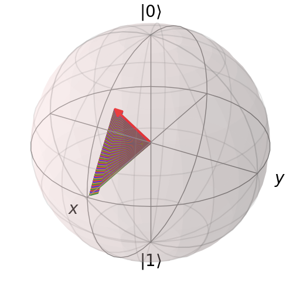
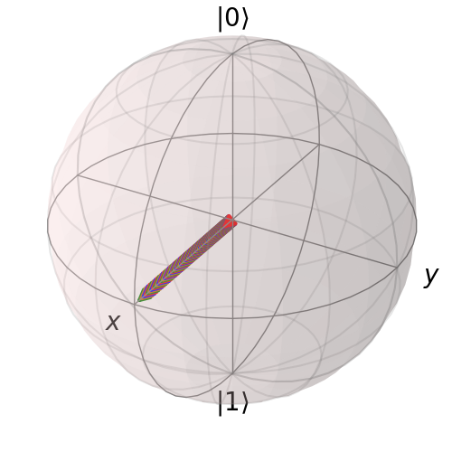
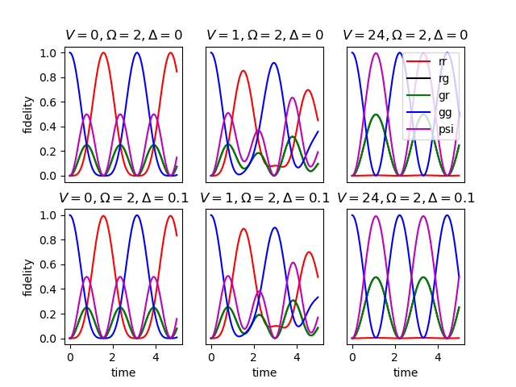

# Quantum computation and Quantum control
This is the notes and code for optimization of control of qubit in quantum computer.

Physical realizations of *quantum computer* includes photonics, NMR, cavity-QED, NV Center, joseph junction, ion trap, silicon quantum dot, Rydberg atom and the most exciting Quantum Topology.

Meanwhile, three models for *quantum computation* are quantum circuit model, one way quantum computation model and adiabatic quantum computation model which we will discuss later. And the three is all equivalent.

量子计算机领域的核心竞争力永远是算力的硬性指标：量子体积（QV）、最大可纠缠数目、单量子比特逻辑门与多量子逻辑门保真度、量子比特的相干时间（t1和t2）、量子逻辑门的操作时间。

Adiabatic quantum computation model, transforms the process of quantum computation to a relatively complex Hamiltionian to be solved. Thus its ground state is the solution of our initial problem. Through adiabatic process (that is why we call it Adiabatic quantum computation model), we could control a rather simpler Hamiltionian to the Hamiltionian we want by experimental tools.  

So, the problem is how we control the Hamiltionian so that the ground state could evolve to the outcome state of computation and meets actual experimental conditions. That is what *Quantum Control* focuses on. And the regulatable Hamiltionian is the basis of *Quantum Control*.

The so-called **actual experimental conditions**, explicitly, meaning:

1. 控制时间要短，控制要快。我们的控制要足够快以免系统退相干(decoherence), 一旦超过这个“相干时间”，量子比特就可能会丢失它们的量子信息，从而在计算中引入错误。
2. Robustness, 抗噪声性。也就是说我们的控制要对控制条件的细小变化不够敏感，这才与实际相吻合，因为我们的激光相位、频率、脉冲面积不可能无限精确。
3. 高保真度。我们的演化出来的末态要与实际相差的足够小，通常需要低于1%的错误率，才能应用量子纠错surface code。通常要99.99%的保真度才能进行有效的量子计算。这也就是为啥量子拓扑很exciting。(当我们操纵系统的演化达到末态我们如何来测量保真度，by QPT,QST,GST, RB)。
4. 控制变化应平缓。 起伏大意味着掺杂的高频分量多，易导致更高的激发，由二能级变为多能级。

所以控制量子态的方法有哪些呢？这里以
里德堡原子为例，主要是利用电磁调控。


## 脉冲控制

电磁波操控两能级系统(即qubit)，一般是用激光来操控，这称为Rabi问题，让二能级系统产生Rabi振荡，也就是在ground state与excited state中产生周期性的震荡。我们最常用的两种模型为
Landau-Zener model和 Jaynes–Cummings model. 

The first is the semi-classical Rabi model. This model assumes a quantized atom and a classical description of the field, whose Hamiltionian is:

$$
 H=\Delta(t)\sigma_z+\omega_R\sigma_x=\left(
    \begin{array}{ccc}
        \Delta(t) & \omega_R \\
        \omega_R & -\Delta(t) \\
    \end{array}
\right)
$$

其中$\Delta(t)$ 是detuning的参数,  为Rabi频率，我们的控制过程优化即优化$\Delta(t)$。通过控制激光的pulse area。当激光的pulse area达到 pi 的时候关掉激光可以得到NOT gate。当pulse area= pi/2, 得到hadamard gate。这种方法在“快速”上达标，但是很难精准控制，在鲁棒性上不达标。

The second model is usually used in Superconductor qubit model. The main difference between this model and the Rabi model is the assumption of a quantized in stead of a classical description of the field. This fully quantum-mechanical model describes the vacuum-field Rabi oscillations, which are presented in the article of Yoshie et al, found bby Edwin Jaynes and Fred Cummings in 1963. Its Hamiltionian is hited at books of Quantum Optics:

$$ H=H_{field}+H_{atom}+H_{int} $$

其中$ H_{field}$是腔内电磁波， $H_{atom}$ 是二能级原子，$H_{int} $为两者的相互作用。


## 绝热演化

我们通过缓慢的调整激光改变哈密顿量，使得二能级的基态进行演化，使得Hamiltonian的对角元变成原Hamiltonian的eigenvalue。
理论上来说只要时间够长绝热量子控制可以达到很高的保真度。绝热控制的鲁棒性很好，但是速度很慢。

## Now items included:

0. qutip notes [qutip笔记](./qutip%20notes.md)
写的太混乱相当于妹写

1. Rabi oscillation [Rabi_oscillation_two_level with qutip](./Rabi_oscillation_two_level_qutip.py), [Rabi_oscillation_three_level with qutip](./Rabi_oscillation_three_level_qutip.py), [Rabi_without_qutip](./Rabi_without_qutip.py)

先考虑两能级系统动力学，其哈密顿量为：
$$
H=H_{free-atom}+H_{free-field}+H_{atom-classical\_field\_interaction}
\\=-\frac{\omega_0}{2}\sigma_z+\frac{\omega_1}{2}\begin{pmatrix}
0 & e^{i\omega t} \\
e^{i\omega t } & 0
\end{pmatrix} 
\\=\frac{1}{2}\begin{pmatrix}
-\omega_0 & \omega_1 e^{i\omega t} \\
\omega_1 e^{i\omega t } & \omega_0
\end{pmatrix} 
$$
The Rabi model is a semi-classical model. This means that we use a classical representation of the field. 
$$
E(t)=E_x(t)=E_0 cos(\omega t)
\\H_{atom-classical\_field\_interaction}=\bm{\hat{d}}·\bm{E}(t)=-\hat{d}E_0cos(\omega t)
$$
Because we do not use a quantum field, there is no free-field Hamiltonian. The physical pictures of Rabi oscillation are like below(absorption of photon and emitted radiation):


或者用基矢来写就是($\hbar=1$)：

$$
\hat{H}=\frac{1}{2}\omega_0(|e><e|-|g><g|)\\-\frac{\omega_1}{2}(|e><g|+|g><e|)
$$

Considering the Interaction Picture and Rotation Wave Approximation(RWP), and the $\Delta$ is the 'detuning',  we have, referring to [简单两能级系统动力学（1）](https://zhuanlan.zhihu.com/p/141175428?utm_source=qq)

$$
\hat{H}=-\frac{\Delta}{2}\sigma_z+\frac{\omega_1}{2}\sigma_x
\\\overset{\text{$\Delta=\omega_0-\omega$}}{\xlongequal{\quad\quad\quad}}\frac{1}{2}
\begin{pmatrix}
\omega-\omega_0 & \omega_1 \\
\omega_1 & \omega_0-\omega
\end{pmatrix}
\\=\frac{1}{2}
\begin{pmatrix}
\Delta & \omega_1 \\
\omega_1 & \Delta
\end{pmatrix}
$$
其本征值为：
$E_g=-\frac{1}{2}\sqrt{\Delta^2+\omega_1^2}, E_e=\frac{1}{2}\sqrt{\Delta^2+\omega_1^2}$
其布居数随时间演化如下：




现在我们来考虑三能级系统，相比二能级系统，三能级系统在与多模光场相互作用时，会展现出更多丰富的现象。例如 Hanle 效应 [1]、相干布居囚禁[2](CPT,coherent population 、电磁诱导透明 [3]、无反转激光 [4] 等等。这里介绍 $\Lambda$ 型三能级系统中下文‘Adiabatic evolution wtih qutip and without qutip just primary code.’所说的利用(STIRAP)进行绝热的布居迁移 [5]。

ab能级之间有偶极矩μ1，ac能级之间有偶极矩μ2，而bc能级之间的偶极跃迁是禁戒的。外加两束频率分别为ν1和ν2的驱动光场，满足
$$
ω_a−ω_b=ν_1+Δ,ω_a−ω_c=ν_2+Δ
$$
即具有相同的失谐。而ν1,ν2之间频率相差较大，亦或有着不同的偏振，互相之间不会干扰。加两束激光有一个理由就是通常实验室没有足够高频率的激光可以一次性上两个能级。


此时我们不考虑失谐，则此三能级系统的哈密顿量为：
$$
H=\frac{1}{2}[\Omega_r(|e><g|+|g><e|)\\+\Omega_b(|e><r|+|r><e|)]
\\=\frac{1}{2} \begin{pmatrix}
0 & \Omega_r& 0 \\
\Omega_r &0 &\Omega_b \\
0 & \Omega_b & 0
\end{pmatrix}
$$

对应下图（a）


2. Adiabatic evolution wtih qutip and without qutip just primary code. 可参见：[adiabatic_evolution_primarycode](./adiabatic_evolution_primarycode.py)(画出图一的代码),[adiabatic_evolution_withqutip](./adiabatic_evolution_withqutip.py)（画出图二的代码）

This part especially focus on stimulation on three-level system interacting with two light fields, STIRAP(Stimulated Raman Adiabatical Path,受激拉曼绝热路径) explicitly.

我们在上文已经论述过了所谓绝热演化，即缓慢调整外参量使得系统哈密顿量变化，进而使系统基态变化。

我们先来考虑一个toy model.还是用上文的Landau-Zener model：
$$
H=\epsilon \sigma_x+\delta (t)\sigma_z
$$
当我们的$\delta(t)$随时间变化时，系统的基态也随时改变，设最开始出于|0>态,那么我们有什么方法让他变到|1>态呢？（自己思考一下，很简单的。）
那就是：最开始$\delta(t)=-1$，最后$\delta(t)=1$，这样对应的基态就分别是|0>态和|1>态，方便起见我们不如取$\delta(t)=-1+\frac{2t}{T}$,最后如下图所示。

其本征能量如图所示，其代码如[eigenenergy_calculation](./eigenenergy_calculation.py)所示，和[Rabi_without_qutip](./Rabi_without_qutip.py)如出一辙：

看起来很像狄拉克锥吧，嗯？
其能级差最小值为：$\Delta E=2\epsilon$.

然后我们再来考虑上文所说的三能级系统的布局迁移，从子图1我们可以看到，|g>态很好地转移到了|r>态上，基本没有在|e>态上稍作停留，当我们加入较强的耗散项后，便将很大部分的|g>态转移到了|e>态。


3. Dissipative items and its evolutioning states ploted on Bloch Sphere. [布洛赫球演化](./state_evolution_onBlochSphere.py)

这一部分主要是考虑两个初态，即|1> state and |+> state，在H=0的条件下，纯耗散项$\sigma_-, \sigma_z$的作用下在布洛赫球上的演化.

其求解过程如下，主要用到Lindblad方程：
可以手解四个偏微分方程，$\rho\dagger=\rho, Tr(\rho)=1 $,五个条件，
$ \frac{\partial \rho}{\partial t}=\gamma [\sigma_-\rho\sigma_+-\frac{1}{2}(\sigma_+\sigma_-\rho+\rho\sigma_+\sigma_-)]
$

最后结果如下：
$\sigma_-$作用在|+>态上，改变相位，翻转。

$\sigma_z$作用在|+>态上，改变大小，衰减。


在计算的时候发现$Trρ^2$到最后一直大于$\frac{1}{2}$, 推导了一下：
$$
Trρ^2_{mix} =\sum_n \langle n | \sum_i \sum_j p_ip_j|ψ_i \rangle \langle ψ_i| ψ_j \rangle \langle ψ_j| n \rangle \\
= \sum_i \sum_j p_ip_j \langle ψ_i| ψ_j \rangle \langle ψ_j| \sum_n |n \rangle \langle n| ψ_i \rangle \\
=\sum_i \sum_j p_ip_j | \langle ψ_i|ψ_j \rangle|^2 =\sum_i p^2_i <\sum_i p_i = 1 . 
$$

 For a maximally mixed state，which means that its decomposition distribution of states is uniform probability distribution( $\rho =\lambda_i |\lambda_i><\lambda_i|, \lambda_i=\frac{1}{n}$), we have for a given dimension d of the system
$$
Trρ^2_{mix} =\frac{1}{d} > 0 . 
$$

In contrast to the maximally mixed state, the maximally entangled state is the one whose reduced density matrix is maximally mixed state.

$$
\rho_{entangled}= \frac{1}{2}(|00>+|11>)(<00|+<11|)
\\\rho_{reduced\_mixed}=\frac{1}{2}(|0><0|+|1><1|)
$$

4. Optimization of waveform [波形优化](./optimization_of_waveform.py)

~~这块我偷懒了直接搬了师兄的过来~~

考虑噪声后，需要找到一个波形，在哪怕调整哈密顿量有随机噪声时，性能即保真度也不至于那么差，即鲁棒性，100个样品平均来说是最优的。

```
omiga_0=2
N_c=4
Omiga_t=0
T=10
t=np.linspace(0,T,100)
对N_c的依赖很严重 但不需要进行梯度

def fun(x=[])
for i in range(n_c):
    r_k=random()
    omiga_k=2*np.pi*(i+r_k)
    Omiga_t += omiga_0 *(+A_k*np.cos(omiga_k*t)+B_k*np.sin(omiga_k*t))
```


一般用到的优化算法有，CRAB such as Nelder-Mead
BFGS  algorithm 
GRAPE 梯度下降算法 类似deep learning 里的正向传播。下面是调用Nelder-Mead 在python里的包。
```
import scipy.optimize as so

so.minimize(fun, x0, args=(), method='Nelder-Mead', \n
bounds=None, tol=None, callback=None\n 
options={'func': None, 'maxiter': None, 'maxfev': None, 'disp': False, 'return_all': False, 'initial_simplex': None, 'xatol': 0.0001, 'fatol': 0.0001, 'adaptive': False})
```
然后有些东西可以自己来写不调包，能够发现很多隐藏的东西，算出更多的东西，但是Nelder-meal很古老哩。所以没必要自己写。


5. Two-body physics
两体问题的演化，即两个原子or多个比特随时间演化，特别的，两个里德堡态的原子，当两个原子都处于|r>时才会有相互作用。

$$ 
H=H_1\otimes I_2+I_1 \otimes H_2+H_{12} \\
H=[\frac{\Omega}{2}(|r>_1<g|+|g>_1<r|)-\Delta |r>_1<r|]\otimes I_2\\+I_1 \otimes [\frac{\Omega}{2}(|r>_2<g|+|g>_2<r|)-\Delta |r>_2<r|]\\+V|r>_1<r| \otimes |r>_2<r|
$$


画图结果如下：第一张是第二张第六子图放大版，我们可以看到:
$V=24$时，gg态能出现，rr态几乎不出现，rg,gr出现，呈psi态叠加态，使得单独原子的激发态能级升上去,并且周期缩短到原来的$\frac{1}{\sqrt{2}}$倍数，$\Omega_{|w>}$变成等效的 $\sqrt{N}\Omega$




6. EIT(Electronmagnetically induced Transparency)

这一部分讲了电磁诱导透明。也是基于三能级原子，留给后来人写吧。
## Reference

[1] Marlan O. Scully and M. Suhail Zubairy. Quantum optics. Cambridge University Press, 1997.
[2] E. Arimondo. Coherent population trapping in laser spectroscopy. In Wolf, E, editor, Progress in Optics, volume 35, pages 257–354. Elsevier, Amsterdam, 1996.
[3] Michael Fleischhauer, Atac Imamoglu, and Jonathan P. Marangos. Electromagnetically induced transparency: Optics in coherent media. Reviews of modern physics, 77(2):633, 2005.
[4] Marlan O. Scully, Shi-Yao Zhu, and Athanasios Gavrielides. Degenerate quantum-beat laser: Lasing without inversion and inversion without lasing. Phys. Rev. Lett., 62(24):2813–2816, June 1989.
[5] J. R. Kuklinski, U. Gaubatz, F. T. Hioe, and K. Bergmann. Adiabatic population transfer in a three-level system driven by delayed laser pulses. Phys. Rev. A, 40(11):6741–6744, December 1989.

本文大量引用蔡老师的文章（（（，毕竟我从16年就开始关注“浅斟低唱”嘞。具体文献下述文章也都提到过。

[CRAB & dCRAB 简述](https://zhuanlan.zhihu.com/p/350422093)

[Quantum-opitcs-with-python](https://github.com/caidish/Quantum-Optics-with-Python)

[Documents on QuTiP](https://qutip.org/docs/latest/guide/dynamics/dynamics-data.html)

[Qutip Tutorial by vegetable.zhang](https://zhuanlan.zhihu.com/p/274295011?ivk_sa=1024320u)

[相干布居囚禁与绝热布居转移,chaoli](https://chaoli.club/index.php/4037/0#p44776)

[用QuTip学量子光学(四):三原子系统(1):相干布局囚禁(CPT),绝热拉曼路径(STIRAP)](https://zhuanlan.zhihu.com/p/33913599)

[量子调控在量子计算领域有哪些应用和影响？](https://www.zhihu.com/question/274423673/answer/374468139)

[使用RWA化简多能级原子与多模场耦合](https://zhuanlan.zhihu.com/p/165347166)

[Rotation wave approximation](https://zhuanlan.zhihu.com/p/266297809)

[简单两能级系统动力学（1）](https://zhuanlan.zhihu.com/p/141175428?utm_source=qq)

[简单两能级系统动力学（2）](https://zhuanlan.zhihu.com/p/142001362)